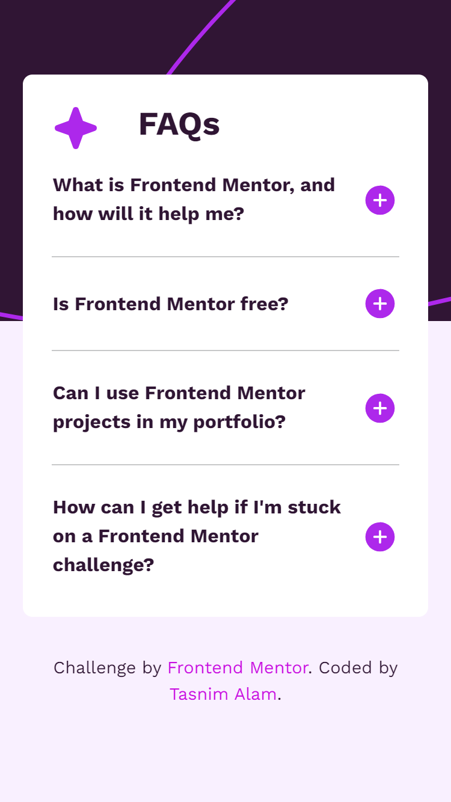

# Frontend Mentor - FAQ accordion solution


This is a solution to the [FAQ accordion challenge on Frontend Mentor](https://www.frontendmentor.io/challenges/faq-accordion-wyfFdeBwBz). Frontend Mentor challenges help you improve your coding skills by building realistic projects. 

## Table of contents

- [Overview](#overview)
  - [The challenge](#the-challenge)
  - [Screenshot](#screenshot)
  - [Links](#links)
- [My process](#my-process)
  - [Built with](#built-with)
  - [What I learned](#what-i-learned)
  - [Continued development](#continued-development)
  - [Useful resources](#useful-resources)
- [Author](#author)

## Overview

### The challenge

Users should be able to:

- Hide/Show the answer to a question when the question is clicked
- Navigate the questions and hide/show answers using keyboard navigation alone
- View the optimal layout for the interface depending on their device's screen size
- See hover and focus states for all interactive elements on the page

### Screenshot



### Links

- Solution URL: [Repository]()
- Live Site URL: [Live Preview]()

## My process

### Built with

- Semantic HTML5 markup
- CSS custom properties
- Flexbox
- CSS Grid
- Mobile-first workflow
- [Bootstrap](https://getbootstrap.com/docs/5.3/layout/breakpoints/) - Powerful, extensible, and feature-packed frontend toolkit

### What I learned

This is my first project where I used Bootstrap framework. I tried to practice and get familiar with notations.

```html
  <div class="row">
        <button
          class="btn d-flex justify-content-between align-items-center"
          data-bs-toggle="collapse"
          data-bs-target="#row1"
          aria-expanded="false"
          aria-controls="row"
        >
          <b>What is Frontend Mentor, and how will it help me?</b>
          
        </button>

        <div class="row collapse mt-2" id="row1">
          <p>
            Frontend Mentor offers realistic coding challenges to help
            developers improve their frontend coding skills with projects in
            HTML, CSS, and JavaScript. It's suitable for all levels and ideal
            for portfolio building.
          </p>
        </div>
      </div>
```

```js
const buttons = document.querySelectorAll('.btn');

buttons.forEach((item) => {
    item.addEventListener('click', switchState);

    function switchState() {
        const isExpanded = item.getAttribute('aria-expanded') === 'true';

        if (isExpanded) {
            item.children[1].setAttribute('src', 'assets/images/icon-minus.svg');
        } else {
            item.children[1].setAttribute('src', 'assets/images/icon-plus.svg');
        }
    }
});
```

## Author
- Website - [Tasnim Alam](https://github.com/Tasnim005)
- Frontend Mentor - [Tasnim005](https://www.frontendmentor.io/profile/Tasnim005)
